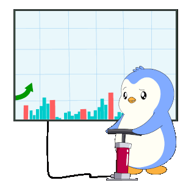

# 投資損益分析報告生成器




## 在線預覽
- 報告範例：[投資損益分析報告](https://fgh09101010.github.io/StockProfitAnalyzer/%E6%8A%95%E8%B3%87%E6%90%8D%E7%9B%8A%E5%88%86%E6%9E%90%E5%A0%B1%E5%91%8A.html)

## 投資損益報告 (Markdown 格式)

完整報告請參考 [investment_report.md](docs/investment_report.md)。

## 專案概述
本專案是一個 Python 程式，用於讀取 Excel 檔案中的投資數據，生成視覺化的投資損益分析報告。報告以 HTML 格式呈現，包含互動式圖表、數據表格及投資金額分配模擬功能，幫助使用者快速了解投資組合表現。

## 功能
- **數據處理**：從 Excel 檔案 (`未實現損益試算.xlsx`) 讀取並清理投資數據。
- **視覺化圖表**：
  - 柱狀圖：比較各商品的投資成本與市值。
  - 氣泡圖：展示投資成本、損益率與股數關係。
  - 圓餅圖：顯示不同損益區間的投資成本比例。
- **數據表格**：使用 DataTables 提供可排序、搜尋的投資明細。
- **投資分配模擬**：根據正報酬項目，動態計算指定金額的分配比例。
- **報告生成**：輸出包含圖表與表格的 HTML 報告，支援中文與響應式設計。

## 執行方式
1. **環境準備**：
   - 安裝 Python 3.6+。
   - 安裝依賴套件：
    ```
     pip install pandas openpyxl
    ```
2. **準備數據**：
   - 將 `未實現損益試算.xlsx` 置於專案根目錄，需包含欄位：項次、商品名稱、類別、股數、成本價、投資成本、帳面收入、損益、損益率、現價、市值、幣別。
3. **執行程式**：
    ```
     python analyze_stock.py
    ```
   程式將生成 `docs/投資損益分析報告.html`。
4. **查看報告**：
   - 於瀏覽器開啟 HTML 檔案，或部署 `docs` 資料夾至 GitHub Pages。

## 依賴套件
- **Python 套件**：
  - `pandas`：數據處理與 Excel 讀取。
  - `openpyxl`：Excel 檔案支援。
- **前端套件**（內嵌於 HTML）：
  - Chart.js：生成互動式圖表。
  - jQuery：支援 DataTables。
  - DataTables：提供動態表格功能。


## 注意事項
- 確保 Excel 檔案格式正確，否則可能導致數據處理錯誤。
- 報告中的圖表與表格需連網載入 CDN 資源。
- 可修改 HTML 中的 CSS 自訂樣式。

## 授權
本專案僅供學習與個人使用，請勿用於商業用途。

