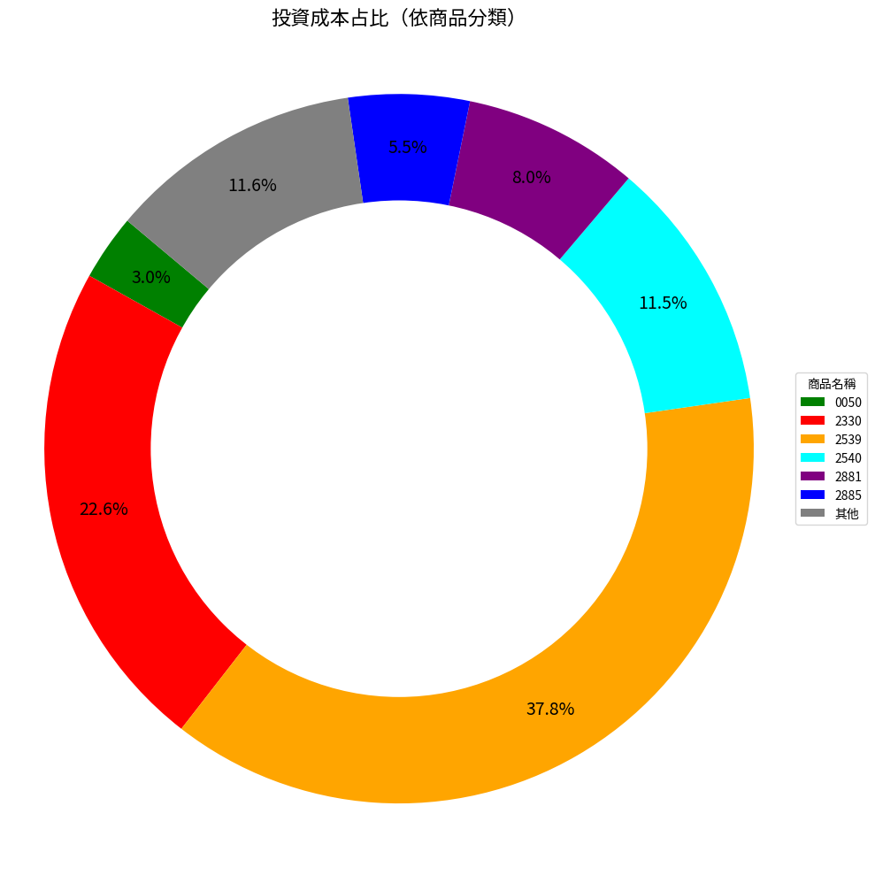

# 投資損益報告

📅 資料日期：2025-08-05 20:46:43　🕒 產生時間：2025-08-06 00:30:05

## 總覽
- 💰 總投資金額：525,548 元
- 📈 市值總額：585,117 元
- 🧮 總損益：56,345 元
- 📊 報酬率：10.72%

## 圖表
### 損益率長條圖

### 損益區間圓餅圖

### 投資成本占比圓環圖

## 各股明細

| 商品名稱 | 股數 | 成本價 | 投資成本 | 帳面收入 | 損益 | 損益率 | 現價 | 市值 |
|----------|------|--------|------------|------------|--------|----------|--------|------------|
| 0050 元大台灣50 | 332.0 | 47.52 | 15,788 元 | 16,985 元 | 1,197 元 | 7.60% | 51.45 | 17,081 元 |
| 00971 野村美國研發龍頭 | 200.0 | 14.78 | 2,958 元 | 2,932 元 | -26 元 | -0.90% | 14.77 | 2,954 元 |
| 00980A 主動野村臺灣優選 | 250.0 | 12.16 | 3,042 元 | 3,017 元 | -25 元 | -0.80% | 12.16 | 3,040 元 |
| 00983A 主動中信ARK創新 | 280.0 | 11.03 | 3,090 元 | 3,062 元 | -28 元 | -0.90% | 11.02 | 3,086 元 |
| 1229 聯華 | 58.0 | 49.64 | 2,881 元 | 2,648 元 | -233 元 | -8.10% | 46.15 | 2,677 元 |
| 1231 聯華食 | 33.0 | 155.09 | 5,121 元 | 4,699 元 | -422 元 | -8.20% | 144.0 | 4,752 元 |
| 1294 漢田生技 | 31.0 | 85.45 | 2,651 元 | 2,387 元 | -264 元 | -10.00% | 77.9 | 2,415 元 |
| 2330 台積電 | 120.0 | 988.63 | 118,735 元 | 137,342 元 | 18,607 元 | 15.70% | 1150.0 | 138,000 元 |
| 2364 倫　飛 | 40.0 | 79.6 | 3,186 元 | 4,228 元 | 1,042 元 | 32.70% | 106.5 | 4,260 元 |
| 2539 櫻花建 | 3652.0 | 54.35 | 198,650 元 | 242,767 元 | 44,117 元 | 22.20% | 66.8 | 243,954 元 |
| 2540 愛山林 | 661.0 | 91.45 | 60,493 元 | 52,176 元 | -8,317 元 | -13.70% | 79.5 | 52,550 元 |
| 2542 興富發 | 65.0 | 45.49 | 2,959 元 | 2,702 元 | -257 元 | -8.70% | 42.0 | 2,730 元 |
| 2881 富邦金 | 485.0 | 86.58 | 42,026 元 | 40,562 元 | -1,464 元 | -3.50% | 84.0 | 40,740 元 |
| 2885 元大金 | 945.0 | 30.67 | 29,006 元 | 30,471 元 | 1,465 元 | 5.10% | 32.4 | 30,618 元 |
| 4104 佳　醫 | 70.0 | 86.6 | 6,067 元 | 5,934 元 | -133 元 | -2.20% | 85.3 | 5,971 元 |
| 4114 健　喬 | 183.0 | 29.09 | 5,328 元 | 6,985 元 | 1,657 元 | 31.10% | 38.5 | 7,046 元 |
| 6221 晉　泰 | 46.0 | 65.89 | 3,033 元 | 2,211 元 | -822 元 | -27.10% | 48.65 | 2,238 元 |
| 6469 大　樹 | 36.0 | 165.5 | 5,962 元 | 5,847 元 | -115 元 | -1.90% | 164.0 | 5,904 元 |
| 6472 保瑞 | 9.0 | 603.11 | 5,433 元 | 6,287 元 | 854 元 | 15.70% | 705.0 | 6,345 元 |
| 6752 叡揚資訊 | 22.0 | 144.73 | 3,187 元 | 3,262 元 | 75 元 | 2.40% | 150.5 | 3,311 元 |
| 6873 泓德能源 | 13.0 | 212.92 | 2,770 元 | 2,430 元 | -340 元 | -12.30% | 189.0 | 2,457 元 |
| 6898 程曦資訊 | 25.0 | 126.48 | 3,182 元 | 2,959 元 | -223 元 | -7.00% | 119.5 | 2,988 元 |
