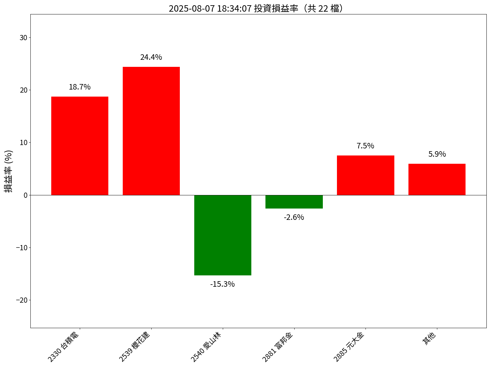
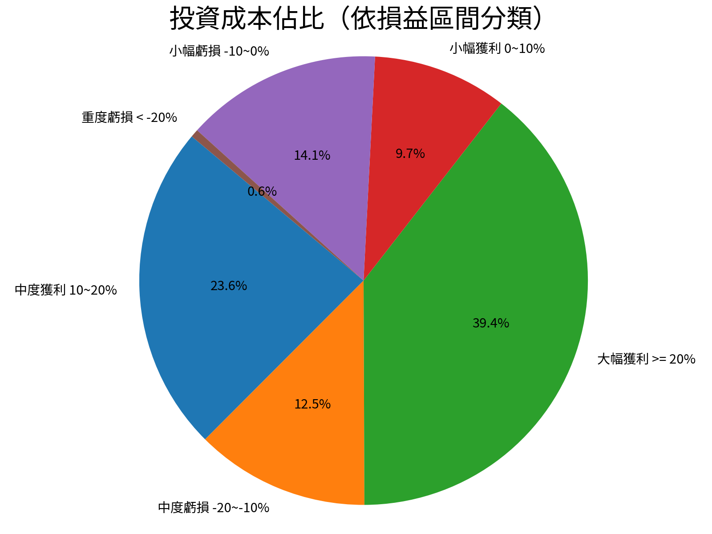
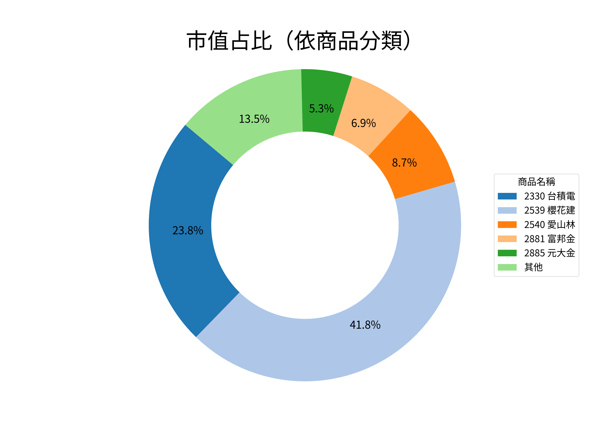

# 投資損益報告

📅 資料日期：2025-08-07 18:34:07　🕒 產生時間：2026-01-08 00:23:10

## 總覽
- 💰 總投資金額：525,548 元
- 📈 市值總額：594,271 元
- 🧮 總損益：65,458 元
- 📊 報酬率：12.46%

## 圖表
### 損益率長條圖

### 損益區間圓餅圖

### 市值占比圓環圖

## 各股明細

| 商品名稱 | 股數 | 成本價 | 投資成本 | 帳面收入 | 損益 | 損益率 | 現價 | 市值 |
|----------|------|--------|------------|------------|--------|----------|--------|------------|
| 0050 元大台灣50 | 332.0 | 47.52 | 15,788 元 | 17,316 元 | 1,528 元 | 9.70% | 52.45 | 17,413 元 |
| 00971 野村美國研發龍頭 | 200.0 | 14.78 | 2,958 元 | 2,928 元 | -30 元 | -1.00% | 14.75 | 2,950 元 |
| 00980A 主動野村臺灣優選 | 250.0 | 12.16 | 3,042 元 | 3,077 元 | 35 元 | 1.20% | 12.4 | 3,100 元 |
| 00983A 主動中信ARK創新 | 280.0 | 11.03 | 3,090 元 | 3,085 元 | -5 元 | -0.20% | 11.1 | 3,108 元 |
| 1229 聯華 | 58.0 | 49.64 | 2,881 元 | 2,642 元 | -239 元 | -8.30% | 46.05 | 2,671 元 |
| 1231 聯華食 | 33.0 | 155.09 | 5,121 元 | 5,028 元 | -93 元 | -1.80% | 154.0 | 5,082 元 |
| 1294 漢田生技 | 31.0 | 85.45 | 2,651 元 | 2,381 元 | -270 元 | -10.20% | 77.7 | 2,409 元 |
| 2330 台積電 | 120.0 | 988.63 | 118,735 元 | 140,926 元 | 22,191 元 | 18.70% | 1180.0 | 141,600 元 |
| 2364 倫　飛 | 40.0 | 79.6 | 3,186 元 | 4,547 元 | 1,361 元 | 42.70% | 114.5 | 4,580 元 |
| 2539 櫻花建 | 3652.0 | 54.35 | 198,650 元 | 247,134 元 | 48,484 元 | 24.40% | 68.0 | 248,336 元 |
| 2540 愛山林 | 661.0 | 91.45 | 60,493 元 | 51,248 元 | -9,245 元 | -15.30% | 78.1 | 51,624 元 |
| 2542 興富發 | 65.0 | 45.49 | 2,959 元 | 2,698 元 | -261 元 | -8.80% | 41.95 | 2,727 元 |
| 2881 富邦金 | 485.0 | 86.58 | 42,026 元 | 40,948 元 | -1,078 元 | -2.60% | 84.8 | 41,128 元 |
| 2885 元大金 | 945.0 | 30.67 | 29,006 元 | 31,176 元 | 2,170 元 | 7.50% | 33.15 | 31,327 元 |
| 4104 佳　醫 | 70.0 | 86.6 | 6,067 元 | 5,962 元 | -105 元 | -1.70% | 85.7 | 5,999 元 |
| 4114 健　喬 | 183.0 | 29.09 | 5,328 元 | 6,994 元 | 1,666 元 | 31.30% | 38.55 | 7,055 元 |
| 6221 晉　泰 | 46.0 | 65.89 | 3,033 元 | 2,163 元 | -870 元 | -28.70% | 47.6 | 2,190 元 |
| 6469 大　樹 | 36.0 | 165.5 | 5,962 元 | 5,775 元 | -187 元 | -3.10% | 162.0 | 5,832 元 |
| 6472 保瑞 | 9.0 | 603.11 | 5,433 元 | 6,341 元 | 908 元 | 16.70% | 711.0 | 6,399 元 |
| 6752 叡揚資訊 | 22.0 | 144.73 | 3,187 元 | 3,284 元 | 97 元 | 3.00% | 151.5 | 3,333 元 |
| 6873 泓德能源 | 13.0 | 212.92 | 2,770 元 | 2,456 元 | -314 元 | -11.30% | 191.0 | 2,483 元 |
| 6898 程曦資訊 | 25.0 | 126.48 | 3,182 元 | 2,897 元 | -285 元 | -9.00% | 117.0 | 2,925 元 |
